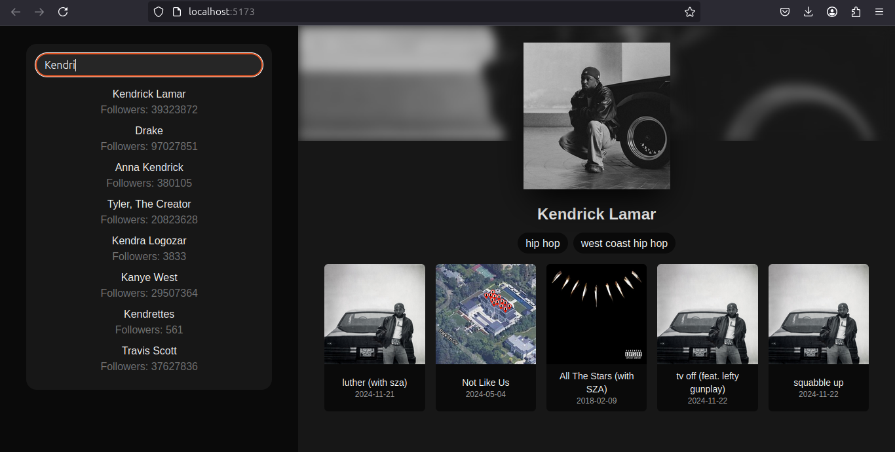

# Artists Search

> This project was created with the aim of studying Tailwind CSS and React technologies, also using the official Spotify API.

## 💻 Prerequisites

Before you begin, please make sure you have met the following requirements:

- You have installed the latest version of `node`
- You have a `<Windows/Linux/Mac>` machine.

## 🚀 Using artists-search

just go to this site!
https://artists-search.vercel.app/

## 📫 Contributing to artists-search

To contribute to artists-search, follow these steps:

1. Fork this repository.
2. Create a branch: `git checkout -b <branch_name>`.
3. Make your changes and commit them: `git commit -m '<commit_message>'`
4. Push to the original branch: `git push origin <project_name> / <location>`
5. Create the pull request.